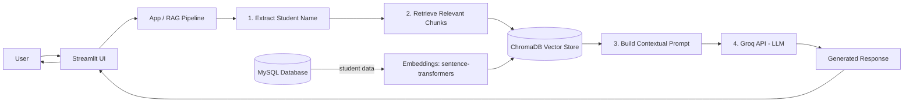

# 🎓 Centralized Student Information System — RAG Chatbot

A Retrieval-Augmented Generation (RAG) chatbot that answers natural-language
questions about student records. It combines a MySQL database, a Chroma
vector store, HuggingFace embeddings, and the Groq API for fast LLM
inference — all wrapped in a Streamlit chat interface.

> Final Year Project, BS Computer Science (Session 2021–2025)
> Institute of Computer Science and Information Technology, Faculty of
> Management and Computer Science, The University of Agriculture, Peshawar,
> Pakistan — July 2025
> Supervised by Mr. Imran ud Din, Lecturer, ICS/IT

This repository is a restructured and extended version of the original
team project. See [Team & Acknowledgment](#-team--acknowledgment) below.


## 📖 About

Educational institutions store student data across multiple database
tables (general info, scholarships, fee records), and accessing it
normally requires SQL knowledge or navigating multi-screen admin
interfaces. This project addresses that by letting users ask plain-English
questions and get answers grounded in the actual database content, instead
of relying on an LLM's general knowledge or exposing the database directly.

## ✨ Features

- **Authentication & role-based access** — `admin`/`faculty` accounts can query any student; `student` accounts can only query their own record
- **Natural-language student lookup** — e.g. *"What is Alice Smith's discipline?"*, *"Is Bob Johnson's fee paid?"*
- **RAG pipeline** — retrieves relevant records from a vector store before asking the LLM, instead of hoping the model already knows the answer
- **MySQL integration** — pulls live data from general, scholarship, and fee-submission tables
- **Groq-powered inference** — fast responses via Groq's hosted LLMs
- **Streamlit chat UI** — simple web interface with persistent chat history per session
- **General Q&A fallback** — answers questions that aren't about a specific student

## 📁 Project Structure

```
student-record-chatbot/
├── app.py                   # Streamlit entry point (streamlit run app.py)
├── src/
│   └── chatbot/
│       ├── config.py        # Environment variable loading & validation
│       ├── database.py      # MySQL connection & data fetching
│       ├── llm_client.py    # Groq API client
│       └── rag_pipeline.py  # Vector store setup, retrieval, prompting
├── data/
│   └── seed.sql             # Sample schema + synthetic data for local dev
├── tests/
│   └── test_rag_pipeline.py # Unit tests for query parsing
├── .env.example              # Template for required environment variables
├── pyproject.toml            # Dependencies (managed with uv)
└── README.md
```

## 🏗️ Architecture

Redrawn from the system architecture in the original thesis (Chapter 6):



**Flow:** a user query comes in through Streamlit → the app extracts a
student name (if any) → relevant record chunks are retrieved from the
Chroma vector store → a grounded prompt is built and sent to the Groq API
→ the response is streamed back to the chat UI. The vector store itself is
built at startup from MySQL data (`student_general_data`,
`student_scholarship`, `student_fee_submission`), split into chunks, and
embedded with `sentence-transformers/all-mpnet-base-v2`.

## 📚 Full Thesis

The complete FYP thesis report — literature review, methodology, testing
& evaluation, results, limitations, and future work — is available here:
[Thesis: Centralized Student Information System (PDF)](https://drive.google.com/file/d/1aw5buTfeFIoA-vQ6hRS12QXcqfjRhVzS/view?usp=sharing)

## 🛠️ Setup

### Prerequisites

- Python 3.10+
- [uv](https://docs.astral.sh/uv/) — fast Python package/dependency manager
- A running MySQL server
- A [Groq API key](https://console.groq.com)

### 1. Clone and install dependencies

```bash
git clone https://github.com/faizan102418/Centralized-Student-Info-system.git
cd Centralized-Student-Info-system
uv sync
```

`uv sync` creates a virtual environment and installs everything pinned in
`pyproject.toml` / `uv.lock`. No manual `venv` or `pip install` steps needed.

### 2. Set up the database

Create the database, then load the sample schema and data:

```bash
mysql -u root -p -e "CREATE DATABASE project_data;"
mysql -u root -p project_data < data/seed.sql
```

`data/seed.sql` also creates a `users` table with three demo accounts for
testing login and role-based access:

| Username | Password | Role | Access |
|---|---|---|---|
| `admin` | `admin123` | admin | Any student |
| `faculty1` | `faculty123` | faculty | Any student |
| `alice` | `alice123` | student | Only Alice Smith's own record |

Change or remove these before any real deployment.

### 3. Configure environment variables

```bash
cp .env.example .env
```

Then edit `.env` and fill in your `GROQ_API_KEY` and MySQL credentials.

### 4. Run it

Streamlit web app:

```bash
uv run streamlit run app.py
```

Or the console version, useful for quick debugging without a browser:

```bash
uv run python -m chatbot.rag_pipeline
```

### Running tests

```bash
uv run pytest
```

## 💬 Example Queries

- "What is Alice Smith's discipline?"
- "Tell me about Charlie Brown's fee status."
- "Is Diana Prince enrolled in any scholarship?"
- "Hello, what can you do?"

## 🧱 Tech Stack

| Layer | Tool |
|---|---|
| LLM inference | [Groq API](https://groq.com) |
| Orchestration | [LangChain](https://www.langchain.com) |
| Embeddings | `sentence-transformers/all-mpnet-base-v2` (HuggingFace) |
| Vector store | [ChromaDB](https://www.trychroma.com) |
| Database | MySQL |
| UI | [Streamlit](https://streamlit.io) |
| Dependency management | [uv](https://docs.astral.sh/uv/) |

## 📝 Notes on the LLM model

Groq periodically retires older models. This project defaults to
`openai/gpt-oss-120b` via the `GROQ_MODEL` environment variable. If you hit a
`model_decommissioned` error, check [Groq's models page](https://console.groq.com/docs/models)
and set `GROQ_MODEL` in your `.env` to whatever's current — no code changes
needed.

## 🗺️ Roadmap / Future Improvements

- [x] Authentication and role-based access control
- [ ] Join student records on a stable student ID instead of name (avoids collisions for duplicate names)
- [ ] Support multi-turn follow-up questions ("what about his fee status?") using conversation context
- [ ] Add pagination / summarization for students with large scholarship/fee histories
- [ ] Replace regex name extraction with proper NER for more robust query parsing
- [ ] Deploy a live demo (Streamlit Community Cloud)
- [ ] Add CI (GitHub Actions) to run tests on every push

## 👥 Team & Acknowledgment

This was originally built as a 3-person Final Year Project team effort,
submitted to the Institute of Computer Science and Information Technology,
The University of Agriculture, Peshawar (Session 2021–2025), supervised by
**Mr. Imran ud Din**.

- **Mohammad Faizan Sajid** (Roll No. 126)
- **Abdur Rauf Shah** (Roll No. 125)
- **Mohammad Mawan Zeb** (Roll No. 104)

This repository is maintained by Mohammad Faizan Sajid as a fork of the
original team submission, restructured with a proper `src/` layout, `uv`
dependency management, fixed deprecated APIs, tests, and ongoing feature
work. See the [Roadmap](#️-roadmap--future-improvements) above for what's
being actively extended.

## 📄 License

MIT — see [LICENSE](LICENSE).
